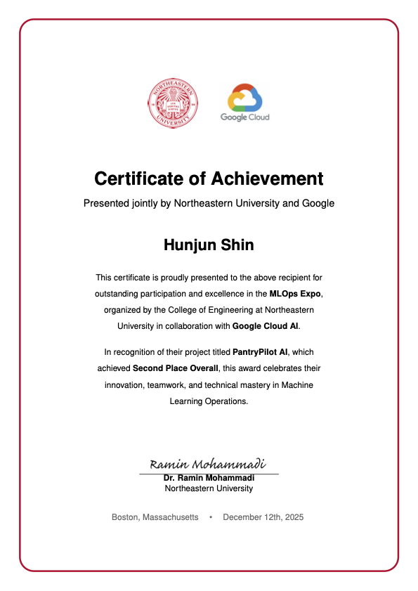
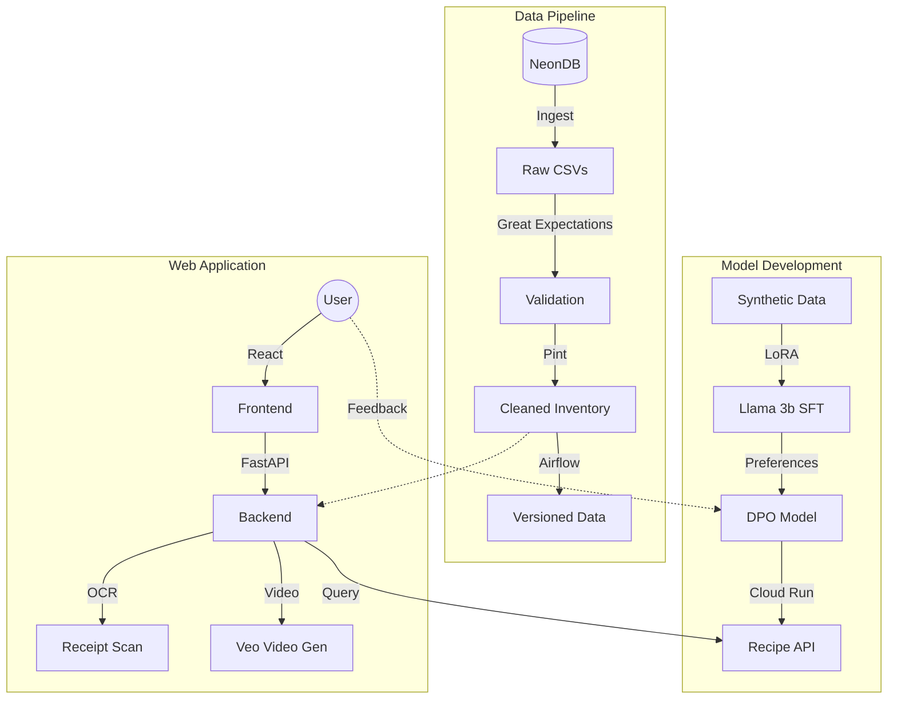

# 🥢 PantryPilot AI

> **🥈 2nd Place Overall - Google Cloud MLOps Expo 2024**
> Organized by Northeastern University & Google Cloud AI (Dec 12, 2025)

<p align="center">
  
</p>

**PantryPilot** is an end-to-end MLOps system that personalizes grocery management and recipe generation. By integrating inventory tracking with a fine-tuned Large Language Model (LLM), it creates recipes that strictly adhere to your dietary needs and available ingredients.

<p align="center">
  
</p>


---

## 📖 Table of Contents

- [🏗️ System Architecture](#️-system-architecture)
- [🔌 1. Data Pipeline](#-1-data-pipeline-data_pipeline)
- [🧠 2. Model Development](#-2-model-development-model_development)
- [🍳 3. Web Application](#-3-web-application-model_deployment)
- [🚀 Setup & Installation](#-setup--installation)
- [🤖 Automated Workflows (MLOps)](#-automated-workflows-mlops)
- [📂 Project Structure](#-project-structure)
- [📜 License](#-license)

---

## 🏗️ System Architecture

PantryPilot operates on two major technical pillars: **Data Pipeline** (for reliable data) and **Model Development** (for intelligent personalization).



---

## 🔌 1. Data Pipeline (`data_pipeline/`)

A robust ETL pipeline ensures that the inventory data feeding the application is accurate, standardized, and monitored.

- **Ingestion**: `ingest_neon.py` extracts snapshots from **NeonDB** (PostgreSQL) into raw CSVs.
- **Validation**: **Great Expectations** validates schema, null checks, and logical rules (e.g., quantity >= 0).
- **Transformation**: `transform_data.py` uses **Pint** to normalize units (e.g., converting "tablespoons" to "ml", handling scaling) and computes low-stock alerts.
- **Orchestration**: Managed by **Apache Airflow** DAGs (`pantry_pilot_dag.py`).
- **Versioning**: All data artifacts are tracked with **DVC** backed by Google Cloud Storage (GCS).

---

## 🧠 2. Model Development (`model_development/`)

We moved beyond generic prompting by fine-tuning open-source models to understand context, constraints, and structured output.

### A. Synthetic Data Generation

To solve the "cold start" problem, we generated **15,000+ synthetic recipes** using Groq (Llama 3.1 8B) across 6 diverse scenarios (e.g., "Full Inventory", "Strict Vegan", "Low Sodium").

### B. Supervised Fine-Tuning (SFT)

- **Base Model**: `meta-llama/Llama-3.2-3B-Instruct`
- **Technique**: **LoRA (Low-Rank Adaptation)** trained on Lambda Labs A100 GPUs.
- **Outcome**: The model learned to strictly follow our JSON schema and dietary constraints (e.g., never suggesting "butter" for a "vegan" request), achieving **99%+ JSON validity** and **70%+ constraint adherence** (vs ~40% for base model).

### C. Direct Preference Optimization (DPO) 🎯

To personalize the experience, we implemented a continuous improvement loop:

1. **Comparison Mode**: Every 7th recipe generation in the app presents **two variants** (Model A vs Model B).
2. **Data Collection**: User choices are saved as preference pairs (Chosen vs Rejected).
3. **Automated Retraining**: A **Cloud Run Job** is triggered when enough feedback accumulates, fine-tuning the model further for specific personas (e.g., "Spicy Korean Lover", "Gluten-Free Italian").

---

## 🍳 3. Web Application (`model_deployment/`)

The full-stack application brings the AI to the user.

### Tech Stack

- **Frontend**: React 19 + Vite + Tailwind CSS (Deployed on Render Static Site).
- **Backend**: FastAPI + SQLAlchemy + Postgres (Deployed on Render Web Service).
- **LLM Service**: Dedicated FastAPI service hosting the fine-tuned model on **Google Cloud Run** (optimized for inference).

### Key Features

- **Strict Dietary Enforcement**: The backend enforces `dietary_restrictions` (stored in User Profile) in every prompt to the LLM.
- **Smart Inventory**:
  - **OCR**: Upload receipts to auto-fill inventory (powered by Gemini Vision).
  - **"Cooked" Action**: Deducts used ingredients from inventory. Logic in `utils/smart_inventory.py` handles complex unit conversions (e.g., recipe asks for "1 cup rice", inventory has "2 kg" -> auto-converts and subtracts).
- **Video Generation**: Integration with **Google Veo** to generate 25s cooking preview videos (mock fallback enabled by default for stability).
- **Real-time Monitoring**:
  - **Slack Alerts**: Triggers an alert to admins if a user submits **5 consecutive dislikes**, indicating a potential quality issue.
  - **Retraining Requests**: Admins get a Slack notification to approve DPO retraining when a user hits 50 interactions.

---

## 🚀 Setup & Installation

### Prerequisites

- Python 3.11+
- Node.js 18+
- PostgreSQL (or NeonDB account)

### 1. Data Pipeline

```bash
cd data_pipeline
pip install -r requirements.txt
cp .env.example .env  # Add DATABASE_URL

# Run full pipeline manually
python -m scripts.ingest_neon
python -m scripts.validate_data
python -m scripts.transform_data
```

### 2. Backend API

```bash
cd model_deployment/backend
pip install -r requirements.txt
uvicorn main:app --reload
```

### 3. Frontend

```bash
cd model_deployment/frontend
npm install
npm run dev
```

---

## 🤖 Automated Workflows (MLOps)

We implemented a **Continuous Training (CT)** pattern:

1. **Feedback Loop**: User Preferences -> DB -> Slack Alert -> Admin Approval.
2. **Training Job**:
    - Container: `Dockerfile.training` (GPU enabled).
    - Action: Pulls new data, runs DPO training (Lambda Labs/Cloud Run), pushes new adapter to GCS (`gs://pantrypilot-dpo-models`).
3. **Deployment**: The Inference Service pulls the latest versioned adapter on startup.

---

## 📂 Project Structure

```
PantryPilot/
├── data_pipeline/               # ETL, Validation, Airflow DAGs
│   ├── airflow/                 # Orchestration logic
│   ├── great_expectations/      # Data quality tests
│   └── scripts/                 # Ingest, Transform, Alerting
├── model_development/           # LLM Training & Evaluation
│   ├── training_pipeline/       # Synthetic Gen, SFT, DPO code
│   ├── llm_eval/                # Metrics (JSON validity, Diet adherence)
│   └── notebooks/               # EDA and experiment notebooks
├── model_deployment/            # Full-Stack Web App
│   ├── backend/                 # FastAPI (App Logic)
│   ├── frontend/                # React (UI)
│   └── cr_backend/              # FastAPI (LLM Inference Service)
└── tests/                       # Unit and Integration tests
```

---

## 📜 License

MIT License. See [LICENSE](./LICENSE) for details.
